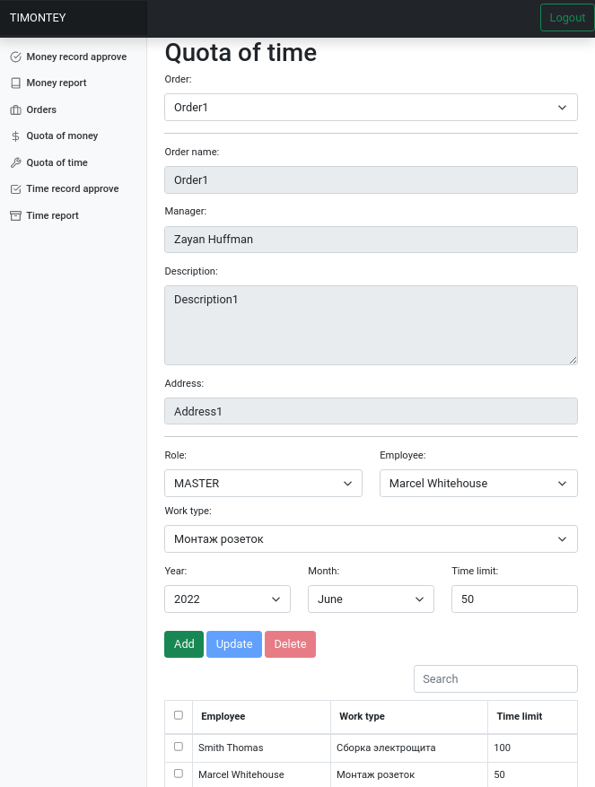

# timontey
#### Web App for a Company That Provides Electrical Installation Services

The purpose of this app is to simplify and automate the communication between managers, foreman and engineers. This process generates reports that are sent to the accounting department.  
In this application, each user can have one or a combination of 4 roles: **ADMIN**, **MANAGER**, **ENGINEER** and **MASTER** (foreman).

##### ADMIN
The duties of the administrator include managing the company's employees (staff), creating a User with a nickname, password and role, as well as managing the list of provided services (work type) and the type of expenses.

##### MANAGER
The duties of the manager include creating a service order, distribution of time and money quotas to employees, verification and approval of work progress and spended money, as well as the creation of a monthly report in excel format, which are sent to the accounting department.

##### MASTER (foreman)
The responsibility of the foreman to regularly record the progress of the provided services, provide information on spending when it necessary and manage the list of his team.

##### ENGINEER
The responsibility of an engineer is similar to a foreman, except that he does not have a team.
